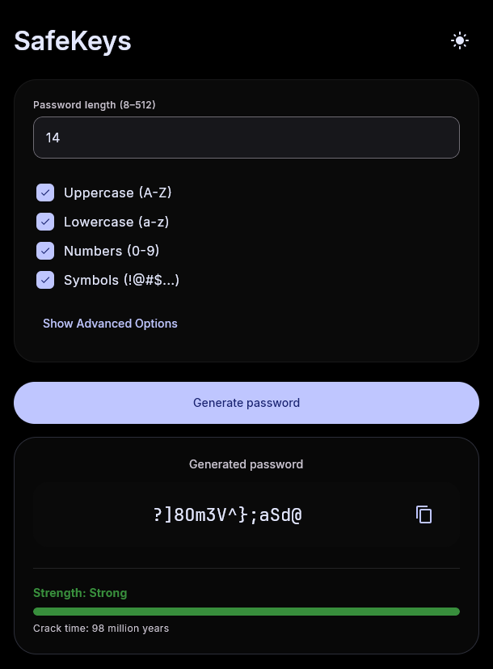

# SafeKeys

**Cross-platform password generator built with Kotlin Multiplatform and Compose Multiplatform**

---

## 📖 Overview

SafeKeys is a open-source password generator that helps you create strong, secure passwords across all your devices. Built with modern technologies, it provides a consistent user experience on Desktop (Windows, macOS, Linux), Android, and iOS.



## ✨ Features

- 🎯 **Customizable Password Generation**
  - Configurable password length (8-128 characters)
  - Include/exclude uppercase, lowercase, numbers, and symbols
  - Option to exclude ambiguous characters (i, l, 1, L, o, 0, O)

- 📊 **Security Analysis**
  - Real-time password strength evaluation
  - Estimated crack time calculation
  - Configurable attacker guessing speed (default: 1 trillion guesses/sec)

- 🌍 **Cross-Platform**
  - Desktop: Windows, macOS, Linux
  - Mobile: Android, iOS
  - Single codebase with native performance

## 🚀 Getting Started

### 📥 Clone the Repository

```bash
git clone https://github.com/eyuppastirmaci/safekeys.git
cd safekeys
```

## 🛠️ Building and Running

### 🖥️ Desktop (Windows, macOS, Linux)

#### Build and Run

```bash
# Run the application in development mode
./gradlew run

# Or on Windows
gradlew.bat run
```

#### Create Distribution Package

```bash
# For macOS (.dmg)
./gradlew packageDmg

# For Windows (.msi)
./gradlew packageMsi

# For Linux (.deb)
./gradlew packageDeb
```

The distribution packages will be created in:
```
composeApp/build/compose/binaries/main/
```

### 🤖 Android

#### Using Android Studio

1. Open the project in Android Studio
2. Wait for Gradle sync to complete
3. Select `composeApp` configuration
4. Click the **Run** button or press `Shift + F10`

#### Using Command Line

```bash
# Build APK
./gradlew assembleDebug

# Build and install on connected device
./gradlew installDebug

# Or on Windows
gradlew.bat assembleDebug
gradlew.bat installDebug
```

The APK will be located at:
```
composeApp/build/outputs/apk/debug/composeApp-debug.apk
```

#### Requirements
- Minimum Android SDK: 24 (Android 7.0)
- Target Android SDK: 36

### 🍎 iOS

#### Requirements
- macOS with Xcode installed
- CocoaPods (usually comes with Xcode)

#### Build and Run

1. Open the project root in terminal
2. Generate Kotlin framework:
   ```bash
   ./gradlew linkDebugFrameworkIosSimulatorArm64
   ```

3. Open the iOS project:
   ```bash
   open iosApp/iosApp.xcodeproj
   ```

4. In Xcode:
   - Select a simulator or connected device
   - Click the **Run** button or press `Cmd + R`

#### Alternative: Using Command Line

```bash
# Build for iOS Simulator
./gradlew iosSimulatorArm64Test

# Note: Installing to physical device requires additional Xcode setup
```

## 🎯 Usage

### Generating a Password

1. **Set Password Length**
   - Enter desired length (8-128 characters)
   - Use the number input field at the top

2. **Choose Character Sets**
   - ✅ Uppercase letters (A-Z)
   - ✅ Lowercase letters (a-z)
   - ✅ Numbers (0-9)
   - ✅ Symbols (!@#$%^&*...)

3. **Advanced Options** (Optional)
   - **Exclude Ambiguous Characters**: Remove characters that look similar (i, l, 1, L, o, 0, O)
   - **Guesses/Second**: Set the attacker's computing power for crack time estimation

4. **Generate**
   - Click the **Generate Password** button
   - Your secure password will appear below

5. **Copy to Clipboard**
   - Click the copy icon next to your password
   - Paste it wherever you need it

## 🏗️ Technology Stack

- **[Kotlin Multiplatform](https://kotlinlang.org/docs/multiplatform.html)**
- **[Compose Multiplatform](https://www.jetbrains.com/compose-multiplatform/)**
- **[Material Design 3](https://m3.material.io/)**
- **[Gradle](https://gradle.org/)**
- **[Kotlin Coroutines](https://kotlinlang.org/docs/coroutines-overview.html)**

## 📂 Project Structure

```
SafeKeys/
├── composeApp/              # Main application module
│   ├── src/
│   │   ├── commonMain/      # Shared code for all platforms
│   │   │   ├── kotlin/
│   │   │   │   └── com/eyuppastirmaci/safekeys/
│   │   │   │       ├── components/     # UI components
│   │   │   │       ├── config/         # Configuration
│   │   │   │       ├── model/          # Data models
│   │   │   │       ├── password/       # Password generation logic
│   │   │   │       ├── platform/       # Platform abstractions
│   │   │   │       ├── theme/          # App theming
│   │   │   │       └── viewmodel/      # Business logic
│   │   │   └── composeResources/       # Shared resources
│   │   ├── androidMain/     # Android-specific code
│   │   ├── iosMain/         # iOS-specific code
│   │   └── jvmMain/         # Desktop-specific code
│   └── build.gradle.kts
├── iosApp/                  # iOS Xcode project
├── gradle/                  # Gradle configuration
└── build.gradle.kts         # Root build file
```

## 🚧 Planned Features

Future enhancements planned for SafeKeys:

- [ ] **Password History** - Save and manage previously generated passwords with local encryption
- [ ] **Strength Presets** - Quick selection for weak, medium, strong, and paranoid password configurations
- [ ] **Batch Generation** - Generate multiple passwords at once for bulk account creation
- [ ] **Custom Character Sets** - Define your own character pools for specialized password requirements
- [ ] **QR Code Export** - Generate QR codes for easy password sharing on local network devices

## 📝 License

This project is licensed under the MIT License - see the [LICENSE](LICENSE) file for details.

## 👤 Author

**Eyüp Pastırmacı**

- GitHub: [@eyuppastirmaci](https://github.com/eyuppastirmaci)
- Project Link: [https://github.com/eyuppastirmaci/safekeys](https://github.com/eyuppastirmaci/safekeys)

## 🙏 Acknowledgments

- [Kotlin Multiplatform](https://kotlinlang.org/docs/multiplatform.html) team for the amazing framework
- [JetBrains](https://www.jetbrains.com/) for Compose Multiplatform

---
